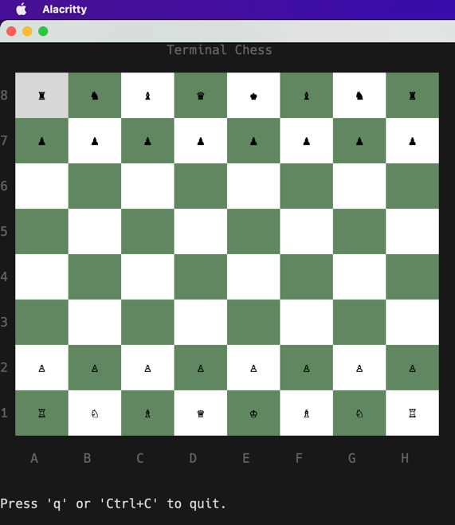

Terminal Chess
=========

Todo
- [x] Setup board
- [ ] Enforce chess rules
  * [x] Piece positions and movements using [Engine](https://github.com/notnil/chess)
  * [ ] Castle (Bug in long castle)
  * [x] Pawn promotion
  * [x] En Passant
- [ ] Save in `PGN` format (UCI + Algebraic)

Bug
- [ ] After promotion mouse does not work

